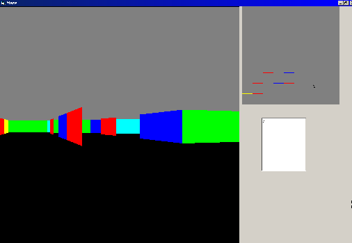



## \[3D maze & frustum \]

### Description

3D "maze" doesn't really have an ending.. but it serves another purpose. This is a cell&portals maze. It uses exact visibility ( recursion ) and clipping to create a view of the maze. I originally had to do this in C++.net using openGL. This USES PURE VB. only a few api calls. I'm looking for someone who has a good idea for a maze building algorithm so i can do some file I/O. right now i just build the maze in the program which takes up A LOT of lines, and could be done much easier by reading a file. anyway, leave your comments, learn, enjoy.
 
### More Info
 

             |
---                |---
**Submitted On**   |2004-12-23 02:44:38
**By**             |[john hollister](https://github.com/Planet-Source-Code/PSCIndex/blob/master/ByAuthor/john-hollister.md)
**Level**          |Advanced
**User Rating**    |4.8 (19 globes from 4 users)
**Compatibility**  |VB 6\.0
**Category**       |[Games](https://github.com/Planet-Source-Code/PSCIndex/blob/master/ByCategory/games__1-38.md)
**World**          |[Visual Basic](https://github.com/Planet-Source-Code/PSCIndex/blob/master/ByWorld/visual-basic.md)
**Archive File**   |[\[3D\_maze\_&18325212232004\.zip](https://github.com/Planet-Source-Code/john-hollister-3d-maze-frustum__1-57868/archive/master.zip)

